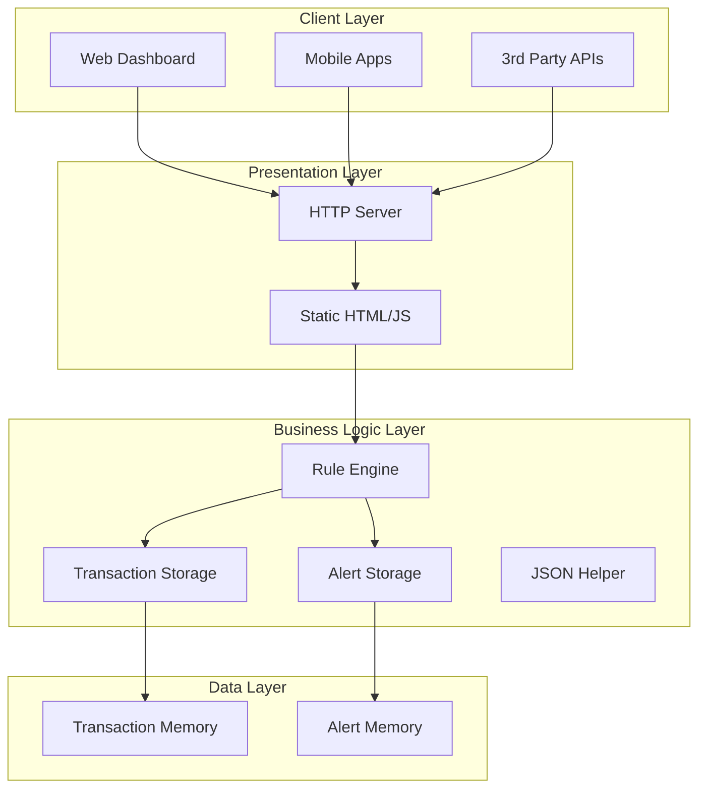
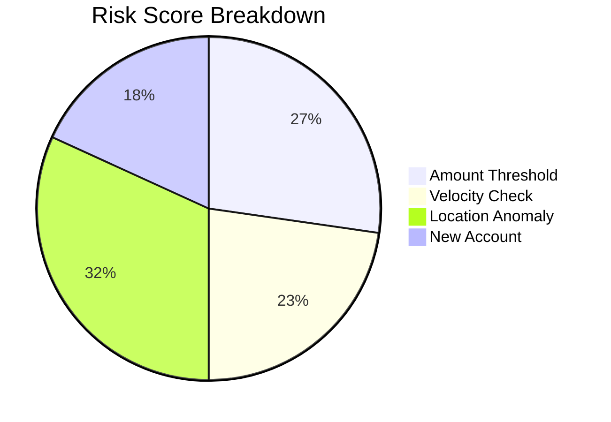
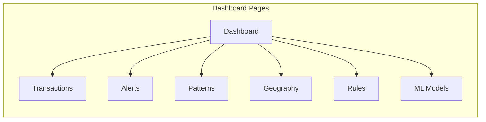
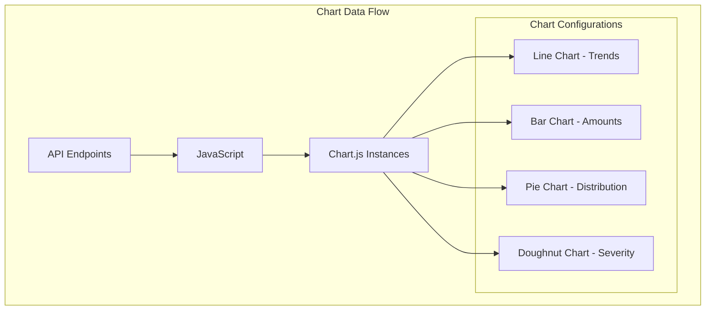
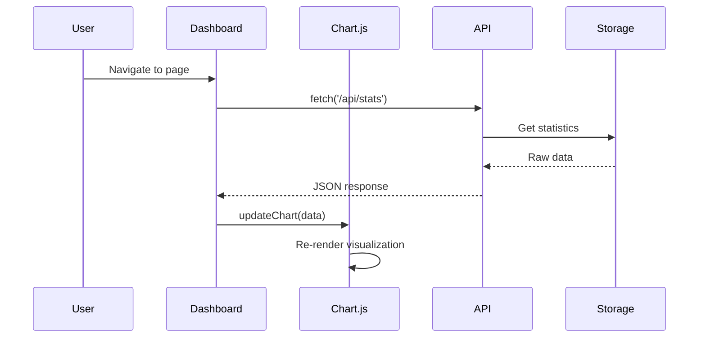
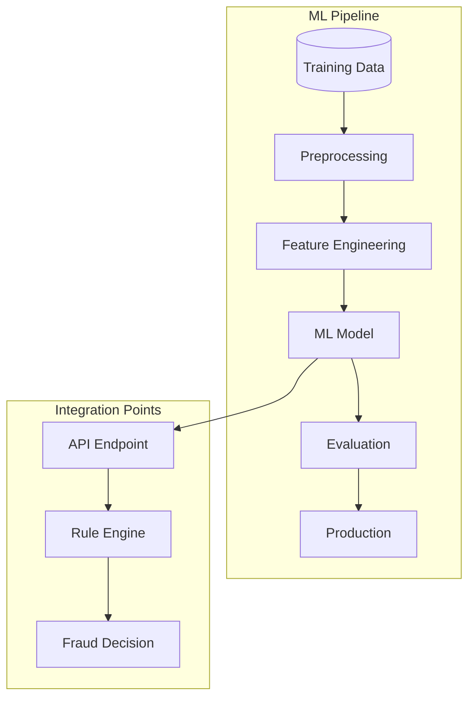
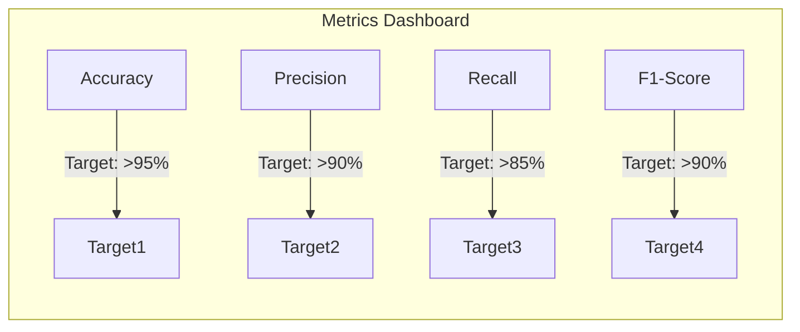

# Fraud Detection System - Project Documentation

## Table of Contents
1. [Project Overview](#project-overview)
2. [System Architecture](#system-architecture)
3. [Core Components](#core-components)
4. [Dashboard Architecture](#dashboard-architecture)
5. [Chart Visualizations](#chart-visualizations)
6. [Machine Learning Integration](#machine-learning-integration)
7. [API Endpoints](#api-endpoints)
8. [Deployment Guide](#deployment-guide)
9. [Future Enhancements](#future-enhancements)

---

## Project Overview

The Fraud Detection System is a real-time Java-based solution designed to automatically detect fraudulent financial transactions. The system analyzes transaction data including amount, time, location, and user behavior patterns to identify suspicious activities.

### Key Features
- **Real-time Transaction Analysis** - Process transactions as they occur
- **Configurable Rule Engine** - Adjustable fraud detection rules
- **Interactive Dashboard** - Comprehensive web-based UI with charts
- **Alert Management** - Automated fraud alerts with severity levels
- **Multi-threaded Processing** - High-performance concurrent processing
- **ML-Ready Architecture** - Prepared for machine learning integration

---

## System Architecture

### High-Level Architecture



### Technology Stack

| Component | Technology |
|-----------|------------|
| Language | Java 17+ |
| HTTP Server | Built-in HttpServer |
| Frontend | HTML5, CSS3, JavaScript |
| Charts | Chart.js |
| JSON Processing | Custom JsonHelper |
| Storage | In-memory ConcurrentHashMap |

---

## Core Components

### 1. FraudDetectionApplication.java
**Purpose**: Main application entry point

**Responsibilities**:
- Initialize HTTP server
- Configure routes for static files and API endpoints
- Start thread pool for request handling

**Key Methods**:
```java
public static void main(String[] args)
    // Starts the server on specified port
```

### 2. FraudHttpHandler.java
**Purpose**: Handle static file serving

**Features**:
- Serves HTML, CSS, JavaScript files
- Content-Type detection
- Security checks for path traversal

### 3. ApiHttpHandler.java
**Purpose**: Handle all API endpoints

**Features**:
- Transaction CRUD operations
- Alert management
- Statistics and patterns
- Rule engine configuration

### 4. RuleEngine.java
**Purpose**: Analyze transactions for fraud indicators

**Detection Rules**:
1. **Amount Rule** - Flags transactions exceeding threshold
2. **Velocity Rule** - Detects rapid successive transactions
3. **Location Rule** - Identifies unusual geographic patterns
4. **New Account Rule** - Monitors new account activities

**Risk Scoring**:


### 5. TransactionStorage.java
**Purpose**: Thread-safe transaction management

**Features**:
- ConcurrentHashMap for fast access
- Deque for transaction ordering
- Maximum 10,000 transactions in memory
- CRUD operations

### 6. AlertStorage.java
**Purpose**: Manage fraud alerts

**Alert Severity Levels**:
- **CRITICAL** - Risk score ≥ 80
- **HIGH** - Risk score 60-79
- **MEDIUM** - Risk score 40-59
- **LOW** - Risk score < 40

### 7. JsonHelper.java
**Purpose**: JSON serialization/deserialization

**Features**:
- Object to JSON conversion
- JSON to object parsing
- Support for complex objects
- Instant (timestamp) handling

---

## Dashboard Architecture

### Dashboard Pages



### Dashboard Components

#### 1. Dashboard Overview
- **Summary Cards**: Total transactions, alerts, rules enabled
- **Trends Chart**: Transaction and fraud trends over time
- **Real-time Updates**: Auto-refresh every 5 seconds

#### 2. Transactions Page
- Data table with all transactions
- Filtering by user, amount, status
- Search functionality
- Export to CSV
- Add new transaction dialog
- Edit/Delete actions

#### 3. Alerts Page
- Alert cards with severity colors
- Expandable details
- Delete alerts
- Status tracking (NEW, INVESTIGATING, RESOLVED)

#### 4. Fraud Patterns Page
- **Hourly Distribution Chart**: Transaction volume by hour
- **Amount Range Chart**: Distribution across amount ranges
- **Day of Week Chart**: Transaction patterns by day

#### 5. Geographic View
- Country fraud distribution
- City-level breakdown
- Interactive map visualization

#### 6. Rules Management
- Enable/disable rules
- Adjust thresholds
- Real-time rule updates

#### 7. ML Models Page
- Model performance metrics
- Accuracy, Precision, Recall, F1 scores
- Training data statistics
- Model comparison

---

## Chart Visualizations

### Chart Types and Data Sources



### Chart Implementation Details

| Chart | Type | Data Endpoint | Purpose |
|-------|------|---------------|---------|
| Trends | Line | `/api/stats` | Show transaction/fraud trends |
| Hourly | Bar | `/api/stats/patterns` | Hourly distribution |
| Amount Ranges | Pie | `/api/stats/patterns` | Amount distribution |
| Geography | Bar | `/api/stats/geography` | Location breakdown |
| Severity | Doughnut | `/api/alerts` | Alert severity |
| Model Performance | Radar | `/api/ml/models` | ML metrics |

### Chart Data Flow



---

## Machine Learning Integration

### ML Architecture



### Supported ML Models

| Model | Use Case | Status |
|-------|----------|--------|
| Random Forest | Classification | Planned |
| XGBoost | Ensemble Learning | Planned |
| Neural Network | Deep Learning | Future |
| LSTM | Time Series | Future |

### Model Performance Metrics



### ML Model Configuration

```json
{
  "model": {
    "name": "RandomForestClassifier",
    "version": "1.0.0",
    "status": "training",
    "metrics": {
      "accuracy": 0.96,
      "precision": 0.94,
      "recall": 0.92,
      "f1Score": 0.93,
      "aucRoc": 0.98
    },
    "trainingData": {
      "totalSamples": 50000,
      "fraudRatio": 0.03,
      "lastUpdated": "2024-01-15"
    }
  }
}
```

### Feature Engineering

**Input Features**:
- Transaction amount
- Time of day
- Day of week
- Location coordinates
- User history
- Merchant category
- Device fingerprint
- IP reputation

**Output**:
- Fraud probability (0.0 - 1.0)
- Risk category (LOW, MEDIUM, HIGH, CRITICAL)
- Confidence score

---

## API Endpoints

### Transactions

| Method | Endpoint | Description |
|--------|----------|-------------|
| GET | `/api/transactions` | Get all transactions |
| GET | `/api/transactions/{id}` | Get transaction by ID |
| POST | `/api/transactions` | Create new transaction |
| POST | `/api/transactions/analyze` | Analyze transaction |
| DELETE | `/api/transactions/{id}` | Delete transaction |

### Alerts

| Method | Endpoint | Description |
|--------|----------|-------------|
| GET | `/api/alerts` | Get all alerts |
| DELETE | `/api/alerts/{id}` | Delete alert |

### Statistics

| Method | Endpoint | Description |
|--------|----------|-------------|
| GET | `/api/stats` | System statistics |
| GET | `/api/stats/patterns` | Fraud patterns |
| GET | `/api/stats/geography` | Geographic distribution |

### Rules

| Method | Endpoint | Description |
|--------|----------|-------------|
| GET | `/api/rules` | Get all rules |
| PUT | `/api/rules` | Update rule status |

### Example Request/Response

**POST /api/transactions/analyze**
```json
Request:
{
  "userId": "user-123",
  "amount": 1500.00,
  "currency": "USD",
  "merchantId": "MRC-001",
  "location": {
    "city": "New York",
    "country": "US"
  }
}

Response:
{
  "transactionId": "TXN-001",
  "fraud": true,
  "riskScore": 65.0,
  "reasons": [
    "Transaction amount exceeds threshold",
    "Unusual location detected"
  ],
  "triggeredRules": ["amount_rule", "location_rule"]
}
```

---

## Deployment Guide

### Prerequisites
- Java 17 or higher
- Maven 3.6+
- Web browser with JavaScript enabled

### Build and Run

```bash
# Compile
javac -d target/classes src/main/java/fraud/*.java

# Run
java -cp target/classes fraud.FraudDetectionApplication 8080

# Access Dashboard
open http://localhost:8080/
```

### Docker Deployment

```dockerfile
FROM openjdk:17-alpine
WORKDIR /app
COPY target/classes /app/classes
COPY src/main/resources/static /app/static
EXPOSE 8080
CMD ["java", "-cp", "/app/classes", "fraud.FraudDetectionApplication", "8080"]
```

---

## Future Enhancements

### Short-term
- [ ] Add PostgreSQL persistence
- [ ] Implement Redis caching
- [ ] Add authentication/authorization
- [ ] Implement rate limiting
- [ ] Add WebSocket for real-time updates

### Medium-term
- [ ] Deploy ML models for fraud detection
- [ ] Add Kafka for event streaming
- [ ] Implement Grafana dashboards
- [ ] Add Prometheus metrics
- [ ] Multi-language support

### Long-term
- [ ] Cloud-native deployment (AWS/Azure)
- [ ] Microservices architecture
- [ ] Graph database for relationships
- [ ] Advanced NLP for descriptions
- [ ] Real-time video analytics

---

## Project Structure

```
fraud-detection/
├── src/
│   └── main/
│       ├── java/
│       │   └── fraud/
│       │       ├── FraudDetectionApplication.java
│       │       ├── FraudHttpHandler.java
│       │       ├── ApiHttpHandler.java
│       │       ├── RuleEngine.java
│       │       ├── Transaction.java
│       │       ├── TransactionStorage.java
│       │       ├── FraudAlert.java
│       │       ├── AlertStorage.java
│       │       ├── FraudDecision.java
│       │       ├── Location.java
│       │       └── JsonHelper.java
│       └── resources/
│           └── static/
│               ├── index.html
│               ├── styles.css
│               └── app.js
├── docs/
│   ├── architecture.md
│   └── PROJECT_DOCUMENTATION.md
├── docker/
├── pom.xml
└── README.md
```

---

## Contributing

1. Fork the repository
2. Create a feature branch
3. Commit changes
4. Push to the branch
5. Create a Pull Request

---

## License

This project is licensed under the MIT License.

---

## Support

For questions or issues, please open a GitHub issue or contact the development team.
